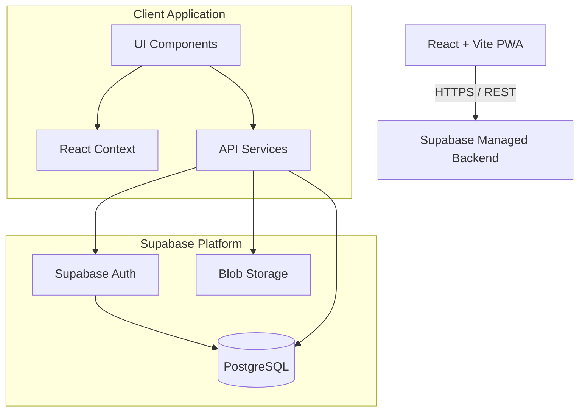

# System Architecture

## 1. High-Level Architecture Overview

The SabraLeos KPI System is built as a Progressive Web Application (PWA) using a decoupled architecture. The frontend is a Single Page Application (SPA) powered by React and Vite, while the backend relies on Supabase, which provides a managed PostgreSQL database, Authentication, and Storage layer.

This architecture ensures high performance, minimal server management overhead, and a highly responsive user experience suitable for mobile and desktop usage.

## 2. Frontend Architecture (Client-Side)

### Technology Stack
- **Framework:** React 18
- **Build Tool:** Vite
- **Styling:** Tailwind CSS
- **Icons:** Lucide React
- **Types:** TypeScript

### Application Structure
The frontend application logic is separated into distinct layers to maintain separation of concerns:
- **Pages** (`src/pages/`): High-level route components that represent distinct screens (e.g., Dashboard, Members, Reports).
- **Components** (`src/components/`): Reusable UI elements and forms (e.g., `Navbar`, `LoginScreen`, `AddContributionForm`).
- **Services** (`src/services/`): Handles all external data fetching and Supabase client interactions.
- **Contexts** (`src/contexts/`): Global state management (`AuthContext` for user session, `ThemeContext` for light/dark mode).
- **Hooks** (`src/hooks/`): Custom React hooks to encapsulate component-level business logic.

### Routing & Navigation
The application uses state-based routing or a client-side router to switch between main screens such as Dashboard, Members directory, User Management, and Reports.

## 3. Backend Architecture (Supabase Layer)

The backend is fully managed by Supabase, reducing the need for custom API endpoints.

### Database (PostgreSQL)
The primary data store is PostgreSQL. It heavily relies on internal database features rather than backend code to ensure data integrity:
- **Triggers & Functions:** Automatic recalculation of total points on `contributions` inserts, updates, or deletions.
- **Constraints:** Foreign key constraints to ensure consistency between users, members, and contributions.

### Authentication & Authorization
- **Authentication:** Handled by Supabase Auth (Email/Password).
- **Authorization:** Handled via database-level **Row Level Security (RLS)** policies. This ensures that unauthorized users cannot read or modify data, even if they have direct database access.

#### Role-Based Access Control (RBAC)
The app implements three distinct access levels:
1. **Super Admin**: Full access. Can manage users, edit all members, and modify all contributions.
2. **Editor**: Can add, edit, and delete members and contributions. Cannot manage system users.
3. **Viewer**: Read-only access to dashboards, member lists, and reports.

### User-Member Architecture Link
A critical architectural pattern in this application is the linkage between system users and club members:
- `auth.users` (Supabase generic user object) is extended by a custom `app_users` table.
- `app_users` maps the authenticated user to a specific `reg_no` in the `members` table.
- This mapping ensures that users representing specific club members can accumulate points securely and track their own KPIs.

## 4. Deployment Architecture

### Build & Compilation
Due to Vite's modern build system, the application compiles down into static HTML, CSS, and optimized JavaScript bundles. 

### Hosting Strategy
The application is deployed on a static hosting provider (e.g., Netlify, Vercel). The deployment pipeline follows these steps:
1. **Linting & Type-checking**: `npm run lint` and `npm run typecheck` run to verify code quality.
2. **Build**: `npm run build` compiles the application into the `dist/` folder.
3. **Publish**: The `dist/` artifact is served via CDN globally. No Node.js server is required for the frontend.

## 5. Security Architecture
- **JWT Tokens:** Authenticated sessions use securely stored JWT tokens.
- **RLS Policies:** Data queries are filtered dynamically at the Postgres level based on the JWT token content.
- **Environment Variables:** Connection details (`VITE_SUPABASE_URL`, `VITE_SUPABASE_ANON_KEY`) are injected during the build phase.
